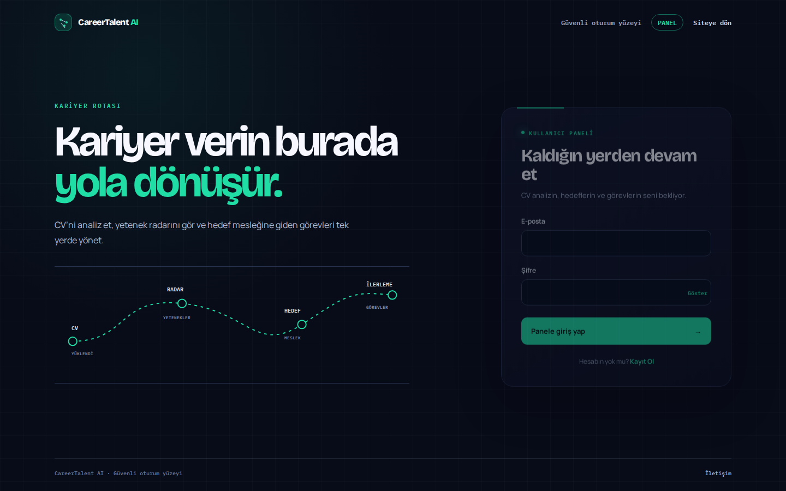
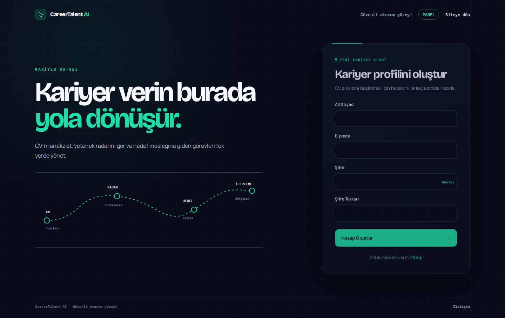
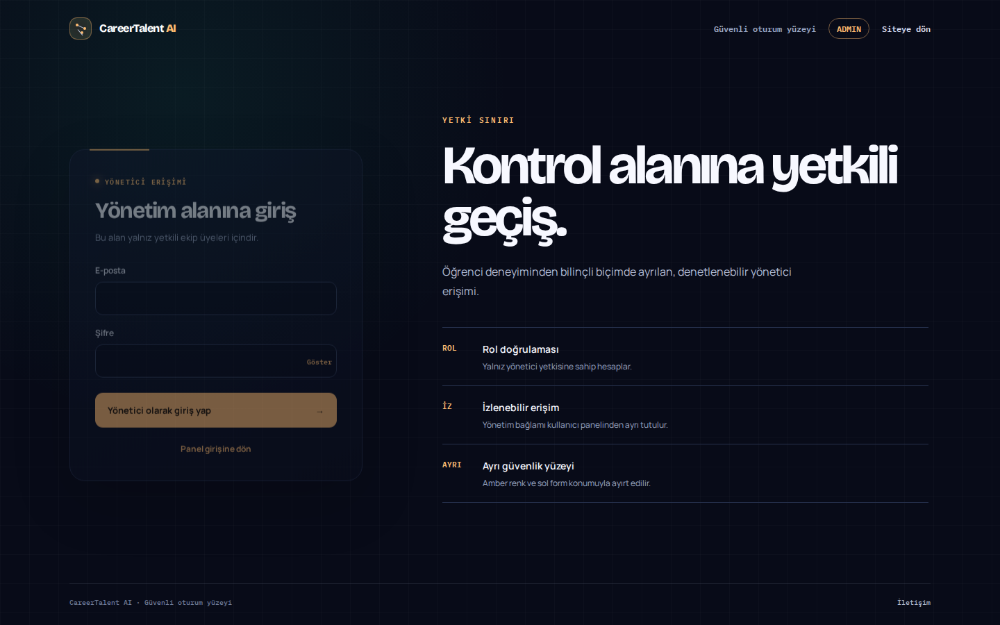
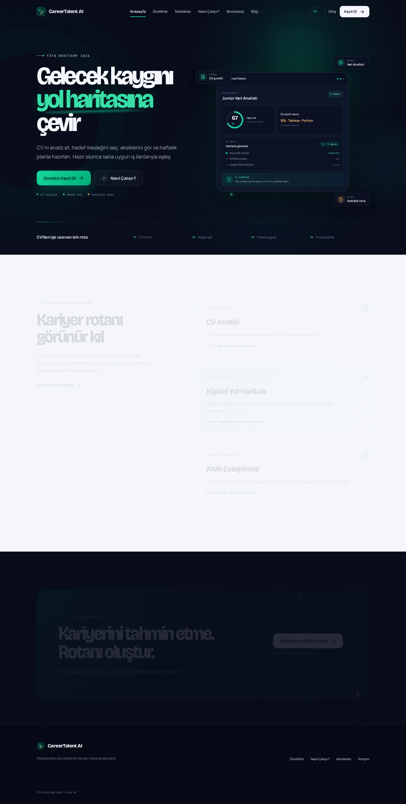
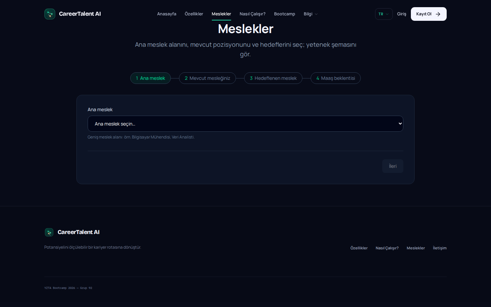
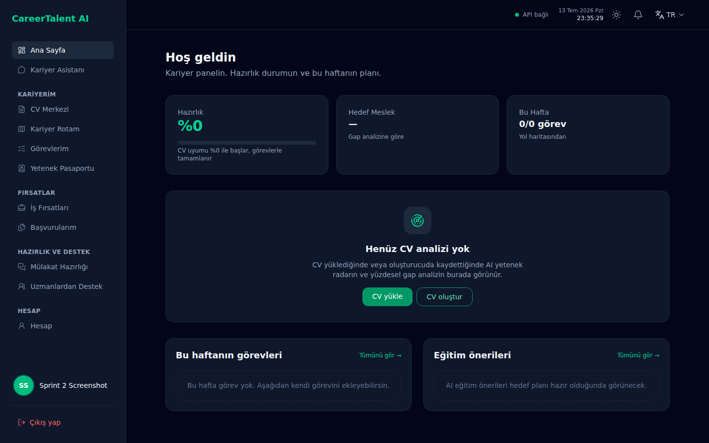

# Sprint 2 — İkinci Sprint

| | |
|---|---|
| **Tarih** | 6 Temmuz – 19 Temmuz 2026 |
| **Süre** | ~14 gün |
| **Hedef** | Kariyer seçimi, gap analizi, yol haritası MVP, hazırlık % göstergesi |
| **Mimari** | Plan A (FastAPI + Laravel) |
| **Durum** | Devam ediyor (16 Temmuz 2026 ara güncelleme) |

---

## Sprint 1'den devralınan durum (5 Temmuz kapanışı)

Sprint 1 tablosu ve backlog [sprint-1-ilk-sprint.md](sprint-1-ilk-sprint.md) dosyasında **değiştirilmeden** duruyor. Özet:

| Alan | Sprint 1 kapanışı | Sprint 2 başlangıcında taşınan |
|------|-------------------|--------------------------------|
| Auth (JWT) | Tamamlanmadı | Must |
| Celery CV kuyruk | Tamamlanmadı | Should |
| `docs/openapi.yaml` v0 | Eksik | Must |
| Marketing 6 placeholder sayfa | Eksik | Should |
| Panel demo veri | Zengin iskelet | Gerçek API'ye bağlama |
| Admin paneli | Planlı | Sprint 2 kapsamı |

**Sprint 1 görselleri (referans):** [Ürün durumu görselleri — Sprint 1](sprint-1-ilk-sprint.md#ürün-durumu-görselleri-sprint-1-teslimi)

---

## Ürün Durumu (16 Temmuz 2026 ara durum)

> Sprint 1 kapanışından bu yana kod tabanı önemli ölçüde ilerledi. Aşağıdaki envanter **canlı ortam + repo** kanıtına dayanır.

**Canlı URL'ler:**
- Tanıtım: https://careertalent.ygtlabs.ai/
- Panel giriş / kayıt: https://careertalent.ygtlabs.ai/panel/login · https://careertalent.ygtlabs.ai/panel/register
- Admin giriş: https://careertalent.ygtlabs.ai/admin/login
- Öğrenci paneli: https://careertalent.ygtlabs.ai/panel
- Admin paneli: https://careertalent.ygtlabs.ai/admin (admin JWT gerekir)
- Eski kısayollar: `/giris` → `/panel/login`, `/kayit` → `/panel/register` (301)

### Katman özeti

| Katman | Sprint 1 (5 Tem) | Bugün (16 Tem) | Delta |
|--------|------------------|----------------|-------|
| Marketing UI | ~55% | ~70% | Meslek sihirbazı, auth formları gerçek; 6 sayfa hâlâ placeholder |
| Panel UI | ~70% demo | ~90% gerçek API | Auth, CV merkezi/geçmişi, dinamik kariyer rotası, görevler, kanıt, AI asistan, ilan ve başvuru akışları |
| Admin UI | Planlı | ~85% gerçek API | Dashboard + 6 gerçek veri modülü + kariyer veri merkezi; cohort ve gelir kapsamı yok |
| Backend API | ~40% | ~85% | JWT, Celery, dinamik career engine, engagement, CV CRUD, admin ve kariyer katalog CRUD |
| Kariyer analizi | Sabit seed denemesi | Dinamik | CV içeriğinden 3–15 kişiye özel A/B/C rolü; sabit meslek sınırı yok |
| Test | ~50% | Güncel | Frontend 148 test; backend 77 test |

### Sprint 1'den tamamlanan (Sprint 2 öncesi / hafta 1)

| Özellik | Kanıt |
|---------|-------|
| JWT auth (register/login/me) | `backend/app/api/v1/auth.py`, `frontend/app/Http/Middleware/EnsureApiAuthenticated.php` |
| Laravel ↔ FastAPI oturum köprüsü | `AuthController.php`, `AuthFlowTest.php` |
| Celery CV analiz kuyruğu | `backend/app/tasks/career.py`, `analyze_cv` task |
| Career engine (CV analiz, hedef, görev planı) | `backend/app/services/career_engine.py`, `backend/app/api/v1/career.py` |
| Panel gerçek API entegrasyonu | `CareerTalentApiClient.php`, `RoadmapController.php`, `TasksController.php` |
| Hazırlık % hesaplama | `TaskReadinessCalculator.php` |
| AI kariyer asistanı | `ChatController.php`, `engagement.py` |
| İlan URL analizi (tek ilan) | `job_opportunity.py`, `JobMatchesController.php` |
| Admin panel + gerçek veri modülleri | `backend/app/api/v1/admin.py`, `AdminController.php` |
| Ayrı auth yüzeyleri (panel + admin login) | `AuthController.php`, `panel/login`, `admin/login` |
| Admin gerçek veri modülleri | `backend/app/api/v1/admin.py`, `AdminController.php` |
| Kariyer veri merkezi | `/admin/kariyer-veri-merkezi`, `career_data.py` |
| Dashboard CV hızlı aksiyon kartı | `dashboard.blade.php`, `DashboardCvRadarTest.php` |
| Canlı deploy | careertalent.ygtlabs.ai |

### Tanıtım sitesi envanteri (14 Temmuz)

| Rota | Durum | Not |
|------|-------|-----|
| `/` | İçerik var | Hero, özellikler, panel önizlemesi, i18n TR/EN |
| `/ozellikler`, `/nasil-calisir`, `/bootcamp` | İçerik var | Lang dosyalarından gerçek metin |
| `/meslekler` | İnteraktif | 4 adımlı sihirbaz + `careers-catalog.json` |
| `/panel/login`, `/panel/register` | Gerçek auth | Panel güvenlik yüzeyi (yeşil tema); FastAPI JWT |
| `/admin/login` | Gerçek auth | Admin güvenlik yüzeyi (amber tema); yalnız `is_admin` |
| `/giris`, `/kayit` | Redirect | 301 → `/panel/login`, `/panel/register` |
| `/fiyatlandirma`, `/galeri`, `/faq`, `/blog`, `/hakkimizda`, `/iletisim` | Placeholder | «İçerik yakında eklenecek» |

### Auth yüzeyleri — ayrı ekran görüntüleri (14 Temmuz)

> Panel ve admin için **ayrı güvenlik yüzeyleri**; marketing `/giris` artık yalnızca redirect. Görseller: `screenshots/sprint-2/auth/`

| Yüzey | URL | Tema | Dosya |
|-------|-----|------|-------|
| Panel giriş | `/panel/login` | Yeşil (öğrenci) | `auth/panel-login.png` |
| Panel kayıt | `/panel/register` | Yeşil (öğrenci) | `auth/panel-register.png` |
| Admin giriş | `/admin/login` | Amber (yönetici) | `auth/admin-login.png` |

**Panel giriş** — https://careertalent.ygtlabs.ai/panel/login

**Panel kayıt** — https://careertalent.ygtlabs.ai/panel/register

**Admin giriş** — https://careertalent.ygtlabs.ai/admin/login

### Panel envanteri (14 Temmuz)

| Rota | Özellik | Veri kaynağı |
|------|---------|--------------|
| `/panel` | Dashboard | Career API + readiness hesabı |
| `/panel/cv-merkezi` | CV yükle / oluştur / analiz | FastAPI CV + Celery |
| `/panel/kariyer-rotam` | Hedef rol, merdiven, görevler, eğitim | Career engine + education search |
| `/panel/kariyer-rotam/gorevler` | Görev listesi, durum, kanıt | Career tasks API |
| `/panel/ilan-analizi` | Tek ilan URL analizi | `job_opportunity.py` |
| `/panel/basvurularim` | Başvuru CRM | Engagement API |
| `/panel/mulakat-hazirligi` | Mülakat simülasyonu | Engagement API |
| `/panel/yetenek-pasaportu` | Yetenek kanıtları | Career evidence API |
| `/panel/ai-yardimcisi` | Kariyer sohbet | LangChain engagement |
| `/panel/uzmanlardan-destek` | Mentor marketplace | Demo fallback (`PanelDemoData`) |
| `/panel/hesap` | Profil + CV geçmişi | Career profile + CV documents |

Eski Sprint 1 rotaları (`/panel/cv-olustur`, `/panel/yol-haritasi` vb.) yeni isimlere **redirect** edilir.

### Admin envanteri (16 Temmuz)

| Rota | Modül | Veri |
|------|-------|------|
| `/admin` | Dashboard | Gerçek DB sayımları + son öğrenciler |
| `/admin/kariyer-veri-merkezi` | Rol, yetenek, kaynak ve gereksinim CRUD | Gerçek FastAPI/DB |
| `/admin/ogrenciler` | Öğrenci ve CV/analiz durumu | Gerçek FastAPI/DB |
| `/admin/readiness` | CV analiz durumu ve yetenek sayısı | Gerçek FastAPI/DB |
| `/admin/yetenek-pasaportu` | Kanıt kayıtları | Gerçek FastAPI/DB |
| `/admin/is-radari` | Analiz edilen iş ilanları | Gerçek FastAPI/DB |
| `/admin/basvurular` | Başvuru kayıtları | Gerçek FastAPI/DB |
| `/admin/mulakatlar` | Mülakat kayıtları | Gerçek FastAPI/DB |

**Not:** Admin rotaları `auth.api` + `auth.api.admin` middleware ile korunur. Cohort, mentor, eğitim, ayarlar ve gelir yönetimi henüz bu gerçek veri kapsamında değil.

### Backend API envanteri (14 Temmuz)

| Grup | Endpoint örnekleri | Durum |
|------|-------------------|-------|
| Health | `GET /health`, `GET /health/ready` | Tamamlandı |
| Auth | `POST /auth/register`, `/login`, `GET /auth/me` | Tamamlandı |
| CV | `POST /cv/analyze`, `/analyze-text`, CRUD documents | Tamamlandı (Celery kuyruk) |
| Career | `POST /career/targets`, `GET .../tasks`, evidence, jobs | Tamamlandı |
| Dinamik kariyer analizi | CV'den `current_role`, skills, radar ve 3–15 A/B/C rolü | Tamamlandı |
| Kariyer veri yönetimi | `/admin/career-data/roles`, `skills`, `sources`, `requirements` CRUD | Tamamlandı |
| Engagement | chat, interview, applications, personal tasks | Tamamlandı |
| Panel (legacy demo) | `GET /panel/dashboard`, `/job-radar`, `/mentors` | Demo fallback; yeni iş `career/*` üzerinden |

**Eksik:** `docs/openapi.yaml` (commit edilmiş sözleşme yok; runtime `/openapi.json` var).

### Test durumu (16 Temmuz)

| Katman | Araç | Sonuç |
|--------|------|-------|
| Frontend | PHPUnit | **148 test, 148 geçti** (16 Temmuz) |
| Backend | pytest | **77 test, 77 geçti** (16 Temmuz) |

---

## Backlog Dağıtma Mantığı

1. Sprint 1'den devreden auth ve kuyruk işleri **Must** olarak önce kapatıldı.
2. CV→analiz→hedef rol→görev planı uçtan uca akışı, ayrı ekran sayısından daha yüksek öncelik aldı.
3. Meslek önerisi sabit katalogtan çıkarıldı; CV içeriğinden 3–15 dinamik A/B/C rolü üreten kariyer motoru kabul edildi.
4. Admin'de demo zenginliği yerine gerçek DB kayıtları ve kariyer veri CRUD kapsamı öne alındı.
5. Tamamlanmayan OpenAPI, marketing içeriği, cohort/gelir ve tam skor otomasyonu Sprint 2 kapanışında yeniden değerlendirilecek.

### Sprint hedefi

Öğrenci hedef mesleğini seçsin, eksik yeteneklerini ve haftalık yol haritasını görsün; hazırlık yüzdesi panelde görünsün.

### Görev dağılımı (güncel durum)

| Görev | Sorumlu | Bitti mi? | Kanıt / not |
|-------|---------|-----------|-------------|
| Gap analizi algoritması | Yiğit | ☑ kısmen | `career_ladder_service.py` + AI gap in `career_engine.py` |
| `GapAnalysisService` + API endpoint | Döne | ☑ kısmen | Ayrı servis sınıfı yok; `/career/analysis/*` üzerinden |
| `RoadmapService` + haftalık görev API | Döne | ☑ | `plan_target()` + Celery; `POST /career/targets` |
| İş ilanı scraper iskeleti | Yiğit | ☑ kısmen | Tek URL parse (`job_listing_parser.py`); toplu scraper yok |
| Livewire: kariyer seçici | Buse | ☐ | Paket kurulu; `app/Livewire/` boş, Blade kullanılıyor |
| Livewire: yol haritası görünümü | Buse | ☐ | `RoadmapController` + Blade |
| Livewire: eğitim önerileri | Buse | ☑ kısmen | Filtre UI var; `education_search.py` canlı arama |
| `data/learning_resources` seed | Yiğit | ☐ | Statik seed yok; AI arama ile dinamik |
| Hazırlık % UI + görsel polish | Bithanya | ☑ kısmen | Dashboard + kariyer rotamda %0 gösterimi |
| Admin panel layout + rotalar (`/admin/*`) | Buse | ☑ | Admin auth + gerçek veri modülleri |
| Admin öğrenci/readiness/iş/başvuru/mülakat verisi | Döne + Buse | ☑ | `admin.py`, `AdminController.php` |
| Kariyer veri merkezi | Döne + Buse | ☑ | Rol/yetenek/kaynak/gereksinim CRUD |
| Admin cohort ve gelir modülleri | Döne + Buse | ☐ | Sprint 2 kalan iş |
| `openapi.yaml` v1 (careers, roadmap) | Döne | ☐ | Runtime OpenAPI var; dosya commit edilmedi |
| JWT auth + kalıcı kullanıcı (Sprint 1 carry) | Döne | ☑ | Sprint 2 hafta 1'de tamamlandı |
| Panel + admin ayrı login/register UI | Bithanya + Buse | ☑ | `/panel/login`, `/panel/register`, `/admin/login` |
| Marketing placeholder sayfaları | Bithanya | ☐ | 6 sayfa hâlâ placeholder |

### Kabul kriterleri

- [x] CV içeriğinden sabit meslek listesine bağlı olmadan 3–15 kişiye özel A/B/C kariyer rolü üretiliyor
- [x] Seçilen meslek için gap listesi + readiness_score dönüyor (CV analizi sonrası)
- [x] Haftalık yol haritası / görev listesi oluşturuluyor (`plan_target`)
- [x] Panelde hazırlık % görünüyor
- [ ] Görev tamamlanınca skor güncelleniyor (MVP: kısmen; kanıt akışı var, otomatik yeniden hesap sınırlı)
- [ ] `docs/openapi.yaml` v1 commit edildi
- [ ] Admin gerçek cohort/öğrenci verisi gösteriyor

### Mimari retro (19 Temmuz — sprint kapanışı)

> **Son Plan B karar noktası.** Sprint 2 sonrası geçiş maliyeti artar; checklist mutlaka doldurulmalı.

| Tetikleyici | Evet/Hayır | Not |
|-------------|------------|-----|
| Çift auth blokajı | Hayır | Laravel session + FastAPI JWT köprüsü çalışıyor |
| API uyumsuzluğu | Kısmen | `openapi.yaml` eksik; panel `career/*` ile hizalandı |
| Upload proxy sorunu | Hayır | CV upload + Celery kuyruk stabil |
| Demo baskısı | Kısmen | Admin çekirdek modülleri gerçek; mentor ve bazı destek yüzeyleri demo fallback |

**Karar:** ☑ Plan A devam ☐ Plan B'ye geç ☐ Kısmi (sadece worker ayrımı)

**Ara gerekçe (16 Tem):** Auth, dinamik career engine ve gerçek admin veri akışı Sprint 2 hedeflerinin çoğunu karşıladı. Plan B tetikleyicileri aktifleşmedi.

---

## Daily Scrum Notları

| Tarih | Kim | Ne yapıldı? | Engel / not |
|-------|-----|-------------|-------------|
| 6.07 | Tüm takım | Sprint 2 kickoff; Sprint 1 carry (auth, Celery) önceliklendi | — |
| 8.07 | Döne | JWT auth, CV Celery task, career engine API | — |
| 10.07 | Buse | Panel rotaları yeniden adlandırıldı (`cv-merkezi`, `kariyer-rotam`); API client genişletildi | — |
| 11.07 | Bithanya | Admin panel layout + demo modüller | Admin gerçek veri bekliyor |
| 12.07 | Yiğit | Career ladder + education search entegrasyonu | Toplu job scraper ertelendi |
| 13.07 | Buse | İş planı v002 (B2B cohort SaaS pivot) taslağı | `docs/is-planlari/2026-07-13-v002-iyilestirilmis-is-plani.md` |
| 14.07 | Bithanya + Buse | Panel/admin ayrı auth yüzeyleri (`/panel/login`, `/panel/register`, `/admin/login`); sprint görselleri güncellendi | `/giris` → 301 redirect |
| 14.07 | Repo güncellemesi | Admin dashboard ve modüller demo veriden gerçek FastAPI/DB kayıtlarına geçirildi | Cohort ve gelir modülleri kapsam dışı |
| 14.07 | Repo güncellemesi | Kariyer veri merkezi eklendi; rol, yetenek, kaynak ve gereksinim CRUD akışları tamamlandı | Katalog kayıtları admin tarafından yönetilir |
| 16.07 | Repo güncellemesi | Dashboard'a her zaman görünen “CV yükle / CV oluştur” kartı geri eklendi; TR/EN ve rota testleri güncellendi | Mükerrer boş-state butonları kaldırıldı |
| 16.07 | Tüm takım | README ve Sprint 2 kaydı runtime gerçeğine göre revize edildi | Sprint 1 kaydı değiştirilmedi |

---

## Sprint Board Updates (16 Temmuz ara özeti)

| Kolon | Öğe sayısı | Örnekler |
|-------|------------|----------|
| **Done** | 11 | Auth/session, Celery CV, CV geçmişi, dinamik career engine, hedef planı, panel API, readiness, AI chat, ilan/başvuru akışları, admin gerçek veri, kariyer veri merkezi |
| **In Progress** | 4 | OpenAPI v1, marketing placeholder, görev→skor otomasyonu, admin cohort/gelir kapsamı |
| **To Do / ertelenen** | 3 | Opsiyonel Livewire geçişi, statik learning_resources, toplu job scraper |

GitHub board: https://github.com/busebatan/careertalent-ai/issues

---

## Her Sprint Sonunda Beklentiler

> **Tam teslim:** 19 Temmuz 2026  
> Şablon: [sprint-rapor-sablonu.md](sprint-rapor-sablonu.md)

- [x] **Backlog Dağıtma Mantığı** güncel öncelik ve kapsam değişiklikleriyle yazıldı.
- [x] **Daily Scrum Notları** 6–16 Temmuz repo kanıtlarıyla güncellendi.
- [x] **Sprint Board Updates** Done / In Progress / To Do olarak özetlendi.
- [x] **Ürün Durumu** gerçek ve demo ayrımıyla kaydedildi.
- [x] **Sprint Review** ve **Sprint Retrospective** ara değerlendirmeleri yazıldı.
- [x] README denetim özeti Sprint 2 ayrıntısıyla hizalandı.
- [ ] 19 Temmuz nihai kapanışında test, demo, açık backlog ve son kararlar yeniden kaydedilecek.

## Sprint Review (16 Temmuz ara değerlendirme)

### Özet (3–5 cümle)

Sprint 1'den taşınan auth ve Celery borçları kapatıldı; OpenAPI dosyası açık kaldı. Öğrenci paneli **career engine API** üzerinden CV analizi, sabit katalog sınırı olmadan 3–15 hedef rol, hedef seçimi, görev planı, hazırlık yüzdesi, kanıt, AI asistan ve tek-ilan analizi sunuyor. Admin paneli gerçek DB sayımları, altı gerçek veri modülü ve kariyer veri merkeziyle çalışıyor; cohort ve gelir kapsamı henüz yok. Tanıtım sitesinde auth ve meslek sihirbazı çalışıyor; 6 alt sayfa placeholder.

### Tamamlanan işler (Sprint 1 sonrası kümülatif)

| Görev | Sorumlu | Kanıt |
|-------|---------|-------|
| JWT auth + Laravel oturum köprüsü | Döne + Buse | `auth.py`, `AuthFlowTest.php` |
| Celery CV analiz kuyruğu | Döne | `tasks/career.py` |
| Career engine (analiz, hedef, görev) | Döne + Yiğit | `career_engine.py`, `test_career_engine.py` |
| Panel gerçek API entegrasyonu | Buse | `CareerTalentApiClient.php`, frontend test suite |
| Hazırlık % UI | Bithanya | `panel-dashboard.png`, `TaskReadinessCalculator.php` |
| AI kariyer asistanı | Döne | `ChatController.php`, `engagement.py` |
| Admin gerçek veri modülleri | Repo güncellemesi | `backend/app/api/v1/admin.py`, `AdminController.php` |
| Kariyer veri merkezi | Repo güncellemesi | `career_data.py`, `admin/career-data.blade.php` |
| Ayrı auth yüzeyleri (panel + admin) | Bithanya + Buse | `panel-login.png`, `panel-register.png`, `admin-login.png` |
| Canlı deploy güncellemesi | Buse | careertalent.ygtlabs.ai |

### Tamamlanmayan / devam eden

| Görev | Sebep | Hedef |
|-------|-------|-------|
| `docs/openapi.yaml` v1 | Zaman; runtime OpenAPI yeterli görüldü | Sprint 2 kapanış |
| Admin cohort ve gelir kapsamı | Çekirdek admin modülleri önceliklendirildi | Sprint 2 kapanış / Sprint 3 |
| Marketing 6 placeholder | İçerik üretimi | Sprint 2 Should |
| Livewire bileşenleri | Blade yeterli görüldü | Sprint 3 veya ertele |
| Toplu job scraper | Tek-ilan MVP öncelik | Sprint 3 |

### Demo durumu (16 Temmuz)

| Akış | Çalışıyor mu? | Not |
|------|---------------|-----|
| Tanıtım sitesi | Kısmen | Çekirdek + meslek sihirbazı evet; 6 sayfa placeholder |
| Kayıt / giriş | Evet | `/panel/login`, `/panel/register`, `/admin/login`; `/giris` redirect |
| CV yükleme | Evet | Celery kuyruk + kalıcı document |
| Kariyer seçimi + gap | Kısmen | CV analizi sonrası hedef plan |
| Yol haritası / görevler | Kısmen | AI plan; boş state yeni kullanıcıda |
| Hazırlık % | Evet | Panel dashboard + kariyer rotam |
| AI sohbet | Evet | Bağlamlı asistan |
| İlan analizi (tek URL) | Evet | URL yapıştır → eşleşme |
| Admin paneli | Kısmen | Çekirdek modüller gerçek DB; cohort/gelir eksik; admin login gerekir |
| Mentor / iş radarı | Demo | `PanelDemoData` fallback |

### Tamamlanma özeti

| Katman | Tamamlanma (tahmini) | Açıklama |
|--------|----------------------|----------|
| Marketing UI | ~70% | Auth + sihirbaz; placeholder sayfalar eksik |
| Panel UI | ~85% | Gerçek API; birkaç modül demo fallback |
| Admin UI | ~85% | Gerçek çekirdek modüller + kariyer veri merkezi; cohort/gelir eksik |
| Backend API | ~85% | Dinamik career engine ve admin API tamam; openapi dosyası eksik |
| Kariyer analizi | Dinamik | CV'den 3–15 kişiye özel A/B/C rolü; sabit meslek sınırı yok |
| Test | Güncel | Frontend 148/148; backend 77/77 |

### Riskler ve engeller

1. Gerçek admin modülleri «cohort ve gelir yönetimi de bitti» algısı yaratabilir; kapsam ayrımı net anlatılmalı.
2. `openapi.yaml` eksikliği panel-backend sözleşmesini kırılgan bırakıyor.
3. Sprint dokümanı runtime değişikliklerinden sonra aynı gün güncellenmezse README ile kod yeniden ayrışabilir.

### Sonraki sprint önceliği (kalan Sprint 2 — max 3)

1. **Admin cohort/gelir kapsamı** + openapi v1 commit
2. Marketing **SSS + fiyatlandırma + iletişim** içeriği
3. Görev tamamlama → readiness skor otomasyonu + kanıt akışı polish

## Sprint Retrospective (16 Temmuz ara değerlendirme)

| İyi gitti | İyileştirilecek | Aksiyon |
|-----------|-----------------|---------|
| CV→dinamik rol→hedef→plan zinciri gerçek API ile kuruldu | Eski sabit meslek anlatımı dokümanda kaldı | README ve Sprint 2 runtime sözleşmesine göre güncellendi |
| Admin demo kayıtları gerçek DB verisine döndü | Cohort/gelir kapsamı henüz yok | Ayrı backlog maddesi ve açık kapsam etiketi |
| Auth, CV kuyruğu ve geçmiş akışı stabil hale geldi | `docs/openapi.yaml` repoda yok | Sprint 2 kapanış önceliği |
| Test sayısı ve kapsamı arttı | Yeni davranış sonrası eski beklenti testi kaldı | Full suite ile drift yakalanıp düzeltilecek |

### Mimari karar

- **Plan A / Plan B:** Plan A devam
- **Gerekçe:** Auth köprüsü ve career engine iki stack ayrımını doğruladı. Plan B maliyeti hâlâ gereksiz.

---

## Ürün durumu görselleri (Sprint 2 — 14 Temmuz)

> Görseller 14 Temmuz yakalamasıdır. Admin ekranı o tarihte demo veriyle kaydedildi; 16 Temmuz runtime'ı gerçek FastAPI/DB verisine geçti. Canlı `/admin` admin JWT gerektirir.

### Tanıtım ve güvenli oturum yüzeyleri

**Ana sayfa** — https://careertalent.ygtlabs.ai/

**Meslek sihirbazı** — https://careertalent.ygtlabs.ai/meslekler

**Auth (panel + admin)** — ayrı görseller: [Auth yüzeyleri bölümü](#auth-yüzeyleri--ayrı-ekran-görüntüleri-14-temmuz) · `screenshots/sprint-2/auth/`

### Öğrenci paneli (kayıtlı kullanıcı)

**Dashboard** — `/panel`

**CV Merkezi** — `/panel/cv-merkezi`

**Kariyer Rotam** — `/panel/kariyer-rotam`

**İlan Analizi** — `/panel/ilan-analizi`

**AI Yardımcısı** — `/panel/ai-yardimcisi`

### Admin paneli (14 Temmuz görseli; 16 Temmuz runtime'ı gerçek veri)

**Dashboard** — `/admin`

**Readiness Analitiği** — `/admin/readiness`

| Ekran | URL | Sprint | Veri |
|-------|-----|--------|------|
| Ana sayfa | `/` | 1→2 | Gerçek |
| Meslek sihirbazı | `/meslekler` | 2 | Gerçek |
| Panel giriş | `/panel/login` | 2 | Gerçek API |
| Panel kayıt | `/panel/register` | 2 | Gerçek API |
| Admin giriş | `/admin/login` | 2 | Gerçek API (admin rol) |
| Panel dashboard | `/panel` | 1→2 | Gerçek API |
| CV merkezi | `/panel/cv-merkezi` | 2 | Gerçek API |
| Kariyer rotam | `/panel/kariyer-rotam` | 2 | Gerçek API |
| AI yardımcısı | `/panel/ai-yardimcisi` | 2 | Gerçek API |
| İlan analizi | `/panel/ilan-analizi` | 2 | Gerçek API |
| Admin dashboard | `/admin` | 2 | 14 Tem görseli demo; 16 Tem runtime gerçek DB |
| Admin readiness | `/admin/readiness` | 2 | 14 Tem görseli demo; 16 Tem runtime gerçek DB |

**Sprint 1 karşılaştırma:** [sprint-1 görselleri](sprint-1-ilk-sprint.md#ürün-durumu-görselleri-sprint-1-teslimi)

### Ekran görüntüsü / video

- Demo URL (canlı): https://careertalent.ygtlabs.ai/panel/login · https://careertalent.ygtlabs.ai/panel/register · https://careertalent.ygtlabs.ai/admin/login · https://careertalent.ygtlabs.ai/panel · https://careertalent.ygtlabs.ai/admin
- Ekran görüntüleri: `screenshots/sprint-2/` · auth ayrı: `screenshots/sprint-2/auth/`
- Video linki (varsa): _

---

*Raporu hazırlayan: Grup 92*  
*Ara güncelleme: 16 Temmuz 2026*

*Durum: Devam ediyor (6 Tem – 19 Tem 2026)*
